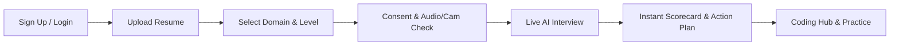

# PrepHire.AI — AI-Powered Mock Interview & Placement Platform

<div align="center">

[](https://prephire-ai.web.app)
[](https://react.dev/)
[](https://www.typescriptlang.org/)
[](https://vitejs.dev/)
[](https://firebase.google.com/)

**Master campus recruitment with resume-tailored AI voice interviews, real-time proctored evaluations, and an interactive coding arena.**

*Designed for Placement Cells, Faculty Mentors, and Engineering Students*

</div>

---

## 🌟 What is PrepHire.AI?

**PrepHire.AI** is an all-in-one placement preparation and assessment platform designed to help students build confidence and excel in campus placement drives. 

By combining conversational AI, resume intelligence, interactive code execution, and institutional oversight, PrepHire.AI delivers a realistic interview simulator that identifies strengths, pinpoints knowledge gaps, and provides concrete, actionable guidance.

---

## 🎯 Who is PrepHire.AI For?

| Role | How They Use the Platform |
|:---|:---|
| 🎓 **Students** | Practice tailored AI interviews, solve coding problems with AI feedback, track scores, study courses, and view leaderboard rankings. |
| 🧑‍🏫 **Faculty Mentors** | Review interview recordings and scorecards for students in their department, audit placement readiness, and share study courses. |
| 🛡️ **Placement Administrators** | Monitor campus-wide readiness metrics, manage user roles and branch assignments, create coding challenges, and review student feedback. |

---

## 🗺️ User Flows & How to Use

### 🎓 Student Flow



1. **Sign Up & Account Setup**:
   - Register using your name, email, password, and select your engineering department/branch.
2. **Resume Upload (Optional but Recommended)**:
   - Upload your PDF resume in the Interview tab. PrepHire extracts your projects, technical skills, and experience to personalize interview questions specifically for you.
3. **Select Interview Mode**:
   - Choose your interview focus:
     - **Technical**: Core DSA, System Design, Web Technologies, Database Systems, OOPs, and branch-specific subjects.
     - **HR & Behavioral**: STAR-method workplace situations, teamwork, leadership, and motivation.
     - **Aptitude**: Quantitative math, logical reasoning puzzles, and speed calculations.
     - **Group Discussion (GD)**: Structured arguments, counter-perspectives, and debate delivery.
   - Choose your difficulty: **Entry**, **Intermediate**, or **Advanced**.
4. **Consent & Verification**:
   - Review the pre-interview camera and audio notice and confirm consent to start your proctored session.
5. **Live AI Voice Interview**:
   - Speak naturally using your microphone or type your responses.
   - PrepHire asks one question at a time, providing calibrated micro-feedback and adjusting difficulty based on your answers.
6. **Instant Performance Scorecard & Action Plan**:
   - View your radar score across 5 key dimensions: **Technical Depth**, **Communication**, **Confidence**, **Clarity**, and **Relevance**.
   - Review specific strengths, targeted areas for improvement, and a **3-step concrete Action Plan** to work on this week.
7. **Coding Hub & AI Code Review**:
   - Practice algorithmic challenges directly in the browser with the built-in code editor.
   - Run tests against sample inputs and submit solutions.
   - Click **"Get AI Review"** after running code to receive instant analysis on correctness, time/space complexity, cleaner alternatives, and code readability.
8. **Courses, Leaderboard & Feedback**:
   - Browse curated courses and tutorials shared by faculty.
   - Track your position on the department leaderboard.
   - Tap the **Feedback** button anytime to share thoughts, report bugs, or request features.

---

### 🧑‍🏫 Faculty Flow

1. **Department Dashboard**:
   - Log in to your faculty portal. The dashboard is automatically scoped to candidates in your engineering branch.
2. **Review Student Interviews & Scorecards**:
   - Inspect individual student session records, radar breakdowns, AI feedback, and proctoring logs.
   - Assess placement readiness and provide personalized mentoring notes.
3. **Course Management**:
   - Create and organize department-specific learning resources, lecture notes, and practice materials for students.

---

### 🛡️ Admin Flow

1. **Overview & Analytics**:
   - Access real-time statistics on total registered students, completed interviews, average scores, and department distributions.
2. **User & Branch Management**:
   - View student and faculty rosters, reassign student branches when needed, and toggle account statuses.
3. **Coding Challenge Authoring**:
   - Create, edit, and publish coding problems with starter templates (Python, JavaScript, C++), visible test cases, and hidden judge test cases.
4. **Feedback Center**:
   - View feedback submitted by students during pilot testing, tagged by category (Bug, Suggestion, Confusing, Other).

---

## 🚀 Key Highlights

- 🎙️ **Natural Voice Interaction**: Real-time speech-to-text and synthetic voice prompts for realistic mock practice.
- 📄 **Smart Resume Analysis**: Personalizes questions based on each candidate's real-world projects and technical stack.
- 💻 **Integrated Code Editor**: Sandboxed multi-language programming workspace with immediate execution and AI code review.
- 📊 **Actionable Analytics**: Comprehensive radar charts, detailed rubrics, and concrete next steps rather than vague scores.
- 🏛️ **Institutional Scope**: Pre-configured support for 9 engineering branches with department-level isolation for faculty.
- 📱 **Mobile & Desktop Responsive**: Clean modern interface designed for smooth interaction across all screen sizes.

---

## 🏛️ Supported Engineering Programs

PrepHire.AI supports tailored tracks for 9 institutional branches:
- Computer Engineering
- Information Technology
- Computer Science & Engineering (AI & ML)
- Computer Science & Engineering (Data Science)
- Computer Engineering (Software Engineering)
- Electronics & Telecommunication Engineering
- Mechanical Engineering
- Chemical Engineering
- Civil Engineering

---

## ⚡ Quick Start & Local Setup

### Prerequisites
- **Node.js** (v20 or higher)
- **npm** (v10 or higher)

### 1. Clone & Install Dependencies

```bash
# Clone the repository
git clone https://github.com/pranav-4797/PrepHire-AI.git
cd PrepHire-AI

# Install client dependencies
npm install

# Install server dependencies
cd server
npm install
cd ..
```

### 2. Configure Environment Variables

Create `.env.local` in the root directory:
```env
VITE_FIREBASE_API_KEY=your_firebase_api_key
VITE_FIREBASE_AUTH_DOMAIN=your_project.firebaseapp.com
VITE_FIREBASE_PROJECT_ID=your_project_id
VITE_FIREBASE_STORAGE_BUCKET=your_project.firebasestorage.app
VITE_FIREBASE_MESSAGING_SENDER_ID=your_sender_id
VITE_FIREBASE_APP_ID=your_app_id
```

Create `server/.env` in the `server` directory:
```env
PORT=3001
GEMINI_API_KEY=your_gemini_api_key
PISTON_API_URL=https://emkc.org/api/v2/piston
```

### 3. Run Locally

```bash
npm run dev
```

- **Frontend**: [http://localhost:5173](http://localhost:5173)
- **Backend API**: [http://localhost:3001](http://localhost:3001)

---

## 🌐 Deployment Overview

PrepHire.AI is ready to deploy on modern cloud platforms:
- **Frontend Hosting**: Firebase Hosting (`firebase deploy --only hosting`)
- **Backend Service**: Render or Docker container (`render.yaml`)
- **Database**: Cloud Firestore (`firebase deploy --only firestore:rules`)

*For step-by-step administrator pilot deployment, refer to [`DEPLOY.md`](./DEPLOY.md).*

---

## 📄 License & Credits

Distributed under the **MIT License**. Built for **MIT Academy of Engineering (MIT AoE), Alandi (Pune)** — Placement & Career Development Cell.
