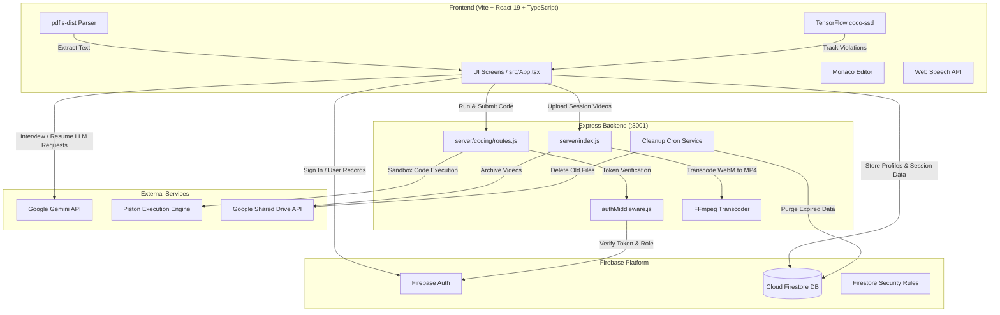

# PrepHire.AI — Next-Generation AI Mock Interview & Assessment Platform

<div align="center">

[](https://prephire-ai.web.app)
[](https://react.dev/)
[](https://www.typescriptlang.org/)
[](https://vitejs.dev/)
[](https://firebase.google.com/)
[](https://ai.google.dev/)
[](https://microsoft.github.io/monaco-editor/)

**Empowering placement candidates with resume-tailored AI voice interviews, proctored assessments, and a sandboxed coding arena.**

*Built for MIT Academy of Engineering, Alandi (Pune) · Placement Cell & Training Division*

</div>

---

## 📋 Table of Contents

- [🌟 Platform Overview](#-platform-overview)
- [🚀 Key Features](#-key-features)
  - [1. Resume-Driven Personalization](#1-resume-driven-personalization)
  - [2. Multi-Domain AI Mock Interviews](#2-multi-domain-ai-mock-interviews)
  - [3. Sandboxed Coding Hub & Judge](#3-sandboxed-coding-hub--judge)
  - [4. Anti-Cheat & Intelligent Proctoring](#4-anti-cheat--intelligent-proctoring)
  - [5. Video Archival & FFmpeg Pipeline](#5-video-archival--ffmpeg-pipeline)
  - [6. Branch-Specific Institutional Governance](#6-branch-specific-institutional-governance)
  - [7. Analytics & Dynamic Leaderboards](#7-analytics--dynamic-leaderboards)
- [🏛️ Supported On-Campus Programs](#️-supported-on-campus-programs)
- [👥 Role-Based Access Control](#-role-based-access-control)
- [📐 System Architecture](#-system-architecture)
- [🛠️ Technology Stack](#️-technology-stack)
- [⚡ Quick Start & Local Setup](#-quick-start--local-setup)
  - [Prerequisites](#prerequisites)
  - [1. Clone Repository](#1-clone-repository)
  - [2. Client Setup](#2-client-setup)
  - [3. Backend Setup](#3-backend-setup)
  - [4. Environment Configuration](#4-environment-configuration)
  - [5. Launch Application](#5-launch-application)
- [🛡️ Security Architecture & Firestore Rules](#️-security-architecture--firestore-rules)
- [🚀 Deployment](#-deployment)
- [📄 License & Institutional Credits](#-license--institutional-credits)

---

## 🌟 Platform Overview

**PrepHire.AI** bridges the gap between academic education and corporate campus recruitment. It provides students with a realistic, high-stakes interview and coding simulator while providing faculty and administrators with comprehensive oversight of student placement readiness.

### Core Value Propositions
- **Tailored Questioning**: Dynamic technical drills and STAR-method behavioral inquiries generated on-the-fly from candidate resume text.
- **Hands-On Coding Practice**: Sandboxed multi-language programming problems evaluated in real-time.
- **Assessment Integrity**: Dual-layer proctoring detecting tab switching, browser focus loss, and face presence.
- **Branch-Specific Scope**: Scoped evaluation workflows aligned with institutional engineering departments.

---

## 🚀 Key Features

### 1. Resume-Driven Personalization
- **Client-Side Privacy**: Resumes are parsed directly in the browser via `pdfjs-dist` without storing the raw PDF file on any server.
- **Structured Profile Extraction**: Gemini AI synthesizes candidate skills, projects, and work history into a clean JSON structure stored in Firestore (`users/{uid}.resumeProfile`).
- **Prompt Injection**: System prompts dynamically incorporate the student's tech stack for technical rounds and career journey for HR rounds.

### 2. Multi-Domain AI Mock Interviews
- **Technical Domain**: Core DSA, System Design, Web Architecture, Concurrency, and Optimization.
- **HR & Behavioral Domain**: STAR-format workplace scenarios, leadership, teamwork, and culture fit.
- **Aptitude Domain**: Quantitative math, logical reasoning, numerical puzzles, and speed estimation.
- **Group Discussion Domain**: Persuasive communication, contemporary industry topics, and debate structure.
- **Voice Interactivity**: Integrated Web Speech API for speech-to-text input and synthetic voice feedback.

### 3. Sandboxed Coding Hub & Judge
- **Monaco Code Editor**: VS Code-grade code editing with syntax highlighting, auto-indentation, and themes.
- **Piston Sandbox Execution**: Multi-language test execution (JavaScript, Python, C++, Java) against public and hidden test cases.
- **Admin Problem Authoring**: Faculty and admins can author challenges, define test cases, specify execution limits, and publish challenges.

### 4. Anti-Cheat & Intelligent Proctoring
- **Face & Phone Detection**: In-browser object detection powered by TensorFlow.js (`coco-ssd`).
- **Focus Tracking**: Tab-switch and window-blur listeners track candidate focus shifts with timestamps.
- **Smart Edge-Case Handling**: File picker operations during resume uploads are whitelisted to prevent false positives.

### 5. Video Archival & FFmpeg Pipeline
- **Automated Capture**: Interview sessions record audio/video chunks and stream them to the Express backend.
- **FFmpeg Transcoding**: Fast server-side conversion from WebM to optimized MP4 format with `+faststart` flags.
- **Google Shared Drive Storage**: Uploads video files to a designated institutional Google Drive with automated cleanup cron.

### 6. Branch-Specific Institutional Governance
- **Scoped Faculty Portals**: Faculty members are automatically scoped to candidates from their own department.
- **Admin Control Center**: Administrators maintain global access across all departments, with branch filtering and inline department re-assignment.

### 7. Analytics & Dynamic Leaderboards
- **Multi-Dimensional Radar Scorecards**: 0–100 scores across Technical Depth, Communication Clarity, Problem Solving, Confidence, and Delivery.
- **Composite Leaderboard Algorithm**: Weighted rankings factoring in interview frequency, peak performance, domain diversity, and proctoring integrity scores.

---

## 🏛️ Supported On-Campus Programs

PrepHire.AI supports the following academic programs:

1. **Computer Engineering**
2. **Information Technology**
3. **Computer Science & Engineering (AI & ML)**
4. **Computer Science & Engineering (Data Science)**
5. **Computer Engineering (Software Engineering)**
6. **Electronics & Telecommunication Engineering**
7. **Mechanical Engineering**
8. **Chemical Engineering**
9. **Civil Engineering**

---

## 👥 Role-Based Access Control

| Role | Permissions & Capabilities |
|:---|:---|
| **Student** | Access AI Mock Interviews, Coding Arena, Leaderboards, Performance History, Course Catalog, and Resume Profile Management. |
| **Faculty** | Scoped to their department: Evaluate candidate interviews, view class leaderboard, author/import courses, and audit student sessions. |
| **Admin** | Full cross-department authority: Manage user roles & branch assignments, author global coding challenges, approve courses, and inspect audit logs. |

---

## 📐 System Architecture



---

## 🛠️ Technology Stack

| Layer | Technologies | Purpose |
|:---|:---|:---|
| **Frontend Core** | React 19, TypeScript, Vite | High-performance SPA with fast HMR |
| **Code Editor** | `@monaco-editor/react` | Sandboxed in-browser code workspace |
| **Client-Side AI & ML** | `@tensorflow/tfjs`, `@tensorflow-models/coco-ssd` | Live face and proctoring detection |
| **Document Processing** | `pdfjs-dist` | In-browser PDF resume text parsing |
| **AI LLM Engine** | Google Gemini (`gemini-3.1-flash-lite-preview`) | Context-aware dynamic question & report synthesis |
| **Backend Runtime** | Node.js, Express | REST API, video processing, and course endpoints |
| **Code Execution Engine**| Piston API | Sandboxed multi-language code runner |
| **Video Processing** | `ffmpeg-static`, `multer` | Video ingestion, optimization, and conversion |
| **Cloud Storage** | Google Drive API (v3) | Institutional storage for proctored recordings |
| **Auth & Database** | Firebase Authentication, Cloud Firestore | Real-time database, rule enforcement, and auth |

---

## ⚡ Quick Start & Local Setup

### Prerequisites
- **Node.js**: `v20.0.0` or higher
- **npm**: `v10.0.0` or higher
- **Firebase CLI**: `npm install -g firebase-tools` (optional for deployment)

### 1. Clone Repository
```bash
git clone https://github.com/pranav-4797/PrepHire-AI.git
cd PrepHire-AI
```

### 2. Client Setup
```bash
npm install
```

### 3. Backend Setup
```bash
cd server
npm install
cd ..
```

### 4. Environment Configuration

#### Client Configuration (`.env.local` in root)
```env
VITE_GEMINI_API_KEY=your_gemini_api_key_here
VITE_FIREBASE_API_KEY=your_firebase_api_key
VITE_FIREBASE_AUTH_DOMAIN=your_project.firebaseapp.com
VITE_FIREBASE_PROJECT_ID=your_project_id
VITE_FIREBASE_STORAGE_BUCKET=your_project.firebasestorage.app
VITE_FIREBASE_MESSAGING_SENDER_ID=your_sender_id
VITE_FIREBASE_APP_ID=your_app_id
```

#### Backend Configuration (`server/.env`)
```env
PORT=3001
CORS_ORIGIN=http://localhost:5173
GOOGLE_SHARED_DRIVE_FOLDER_ID=your_google_drive_folder_id
PISTON_API_URL=https://emkc.org/api/v2/piston
```

### 5. Launch Application
```bash
npm run dev
```
- **Frontend App**: [http://localhost:5173](http://localhost:5173)
- **Backend API**: [http://localhost:3001](http://localhost:3001)

---

## 🛡️ Security Architecture & Firestore Rules

PrepHire.AI enforces strict role-based access directly at the database layer via [firestore.rules](firestore.rules):

```javascript
rules_version = '2';
service cloud.firestore {
  match /databases/{database}/documents {
    function signedIn() { return request.auth != null; }
    function profile() { return get(/databases/$(database)/documents/users/$(request.auth.uid)).data; }
    function role() { return signedIn() ? profile().role : null; }
    function isAdmin() { return role() == 'Admin' || role() == 'admin'; }
    function isFaculty() { return role() == 'Faculty' || role() == 'faculty'; }
    function isStudent() { return role() == 'Student' || role() == 'student'; }

    // Users collection: department, role, and disabled status are immutable by users
    match /users/{userId} {
      allow create: if signedIn() && request.auth.uid == userId;
      allow read: if signedIn() && (request.auth.uid == userId || isAdmin() || isFaculty());
      allow update: if signedIn() && (
        isAdmin() ||
        (
          request.auth.uid == userId &&
          !request.resource.data.diff(resource.data).changedKeys().hasAny(['role', 'disabled', 'department'])
        )
      );
      allow delete: if signedIn() && isAdmin();
    }

    // Sessions collection
    match /sessions/{sessionId} {
      allow create: if signedIn() && (isAdmin() || isFaculty() || (isStudent() && request.resource.data.studentEmail == request.auth.token.email));
      allow read: if signedIn() && (isAdmin() || isFaculty() || (isStudent() && resource.data.studentEmail == request.auth.token.email));
      allow update: if signedIn() && (isAdmin() || isFaculty());
      allow delete: if signedIn() && isAdmin();
    }
  }
}
```

---

## 🚀 Deployment

### Firebase Hosting (Frontend)
```bash
npm run build
firebase deploy --only hosting,firestore:rules
```

### Render (Backend Service)
The backend is configured for deployment via `render.yaml` with automatic Docker container provisioning and system-level FFmpeg support.

---

## 📄 License & Institutional Credits

Distributed under the MIT License. Developed for **MIT Academy of Engineering (MIT AoE), Alandi, Pune** — Placement & Career Development Cell.
