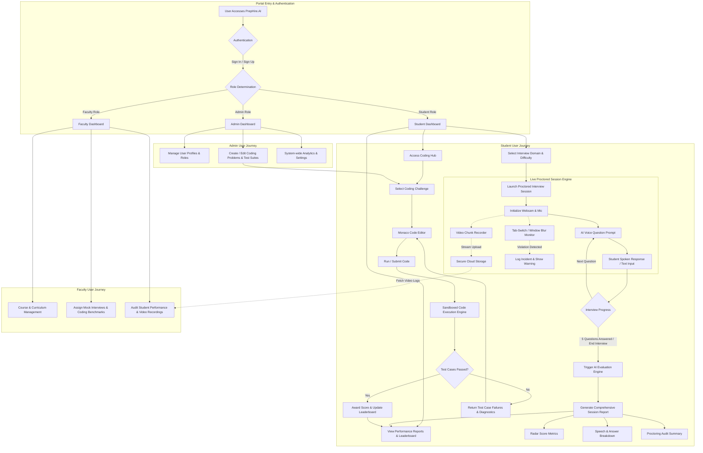

# PrepHire.AI — Next-Generation AI Mock Interview & Technical Assessment Portal

**PrepHire.AI** is an end-to-end, intelligent skill assessment and interview readiness platform designed to bridge the gap between academic preparation and real-world industry recruitment. By combining real-time AI voice interviewers, live proctoring, sandboxed coding challenges, and automated performance analytics, PrepHire.AI provides candidates with a realistic, high-stakes interview environment while giving educators and institution admins full oversight over candidate readiness.

---

## 📋 Table of Contents
- [Portal Overview](#-portal-overview)
- [Key Portal Capabilities](#-key-portal-capabilities)
  - [1. Multi-Domain AI Voice Mock Interviews](#1-multi-domain-ai-voice-mock-interviews)
  - [2. Intelligent Video & Anti-Cheating Proctoring](#2-intelligent-video--anti-cheating-proctoring)
  - [3. Sandboxed Coding Hub & Problem Management](#3-sandboxed-coding-hub--problem-management)
  - [4. AI Performance Reports & Actionable Analytics](#4-ai-performance-reports--actionable-analytics)
  - [5. Gamification & Leaderboards](#5-gamification--leaderboards)
  - [6. Faculty & Course Management](#6-faculty--course-management)
- [User Roles & Permissions](#-user-roles--permissions)
- [User Flow Architecture Diagram](#-user-flow-architecture-diagram)
- [Detailed User Journeys](#-detailed-user-journeys)
  - [Student Flow](#student-flow)
  - [Faculty Flow](#faculty-flow)
  - [Admin Flow](#admin-flow)
- [Session Evaluation & Proctoring Standards](#-session-evaluation--proctoring-standards)

---

## 🌟 Portal Overview

PrepHire.AI empowers job seekers and students to practice technical, behavioral, and analytical interviews in a dynamic, zero-pressure yet proctored setting. The portal acts as an automated interviewer, mentor, proctor, and evaluator all in one.

### Core Objectives:
- **Democratize Interview Preparation**: Provide personalized, interactive voice-driven mock interviews tailored to specific skill domains and difficulty levels.
- **Ensure Assessment Integrity**: Maintain strict proctoring standards through browser event listening, focus tracking, camera verification, and session recording.
- **Provide Actionable Feedback**: Replace vague scores with granular radar charts, strength breakdowns, speech analysis, and concrete improvement plans.
- **Streamline Technical Evaluation**: Offer integrated coding practice environments with automated code execution and instant test case verification.

---

## 🚀 Key Portal Capabilities

### 1. Multi-Domain AI Voice Mock Interviews
The interview system features adaptive question flows powered by natural speech processing:
- **Technical Domain**: Computer Science fundamentals, Data Structures & Algorithms, System Design, Web Engineering, and Software Architecture.
- **HR & Behavioral Domain**: STAR-method workplace scenarios, situational judgment, team collaboration, and leadership qualities.
- **Aptitude Domain**: Quantitative analysis, logical reasoning, numerical puzzles, and speed math.
- **Group Discussion Domain**: Contemporary industry debates, persuasive communication, argument structuring, and consensus building.
- **Difficulty Tiers**: Beginner, Intermediate, and Advanced tiers to match the user's career stage.
- **Voice Interactivity**: Dual speech engine enabling hands-free spoken responses via microphone input and vocalized AI interviewer responses.

### 2. Intelligent Video & Anti-Cheating Proctoring
To replicate real proctored corporate assessments:
- **Live Video Feed**: Continuous webcam streaming during interview sessions.
- **Focus & Tab-Switch Guard**: Automatic detection of window blur, tab switching, or lost browser focus, triggering warnings and logged incidents.
- **Smart Session Recording**: Automated chunked video capturing uploaded directly to secure cloud storage for reviewer access.
- **Early Termination & Contextual Handling**: Context-aware report generation that properly distinguishes between empty sessions, partial interviews, and complete evaluations.

### 3. Sandboxed Coding Hub & Problem Management
A dedicated platform for hands-on programming assessment:
- **Monaco Code Editor**: Professional-grade code editing with syntax highlighting, autocomplete, and theme customization.
- **Sandboxed Code Execution**: Safe multi-language execution (Python, JavaScript, C++, Java, etc.) against test suites.
- **Test Case Validation**: Displays public test cases, hidden validation cases, memory utilization, and execution runtimes.
- **Local Solution Persistence**: Automatic local caching to prevent progress loss.
- **Admin Problem Creator**: Interface for faculty and admins to author custom coding challenges, define hidden test cases, set execution limits, and publish to the student library.

### 4. AI Performance Reports & Actionable Analytics
Upon session completion, the portal generates a comprehensive evaluation scorecard:
- **Skill Metrics**: Scores out of 100 for Technical Accuracy, Communication Clarity, Problem Solving, Confidence, and Time Management.
- **Radar Visualizations**: Graphical overlay comparing current performance against domain benchmark standards.
- **Qualitative Summary**: Highlighting key strengths, key weaknesses, and step-by-step recommended study topics.
- **Proctoring Log Digest**: Summary of any recorded tab switches or camera alerts during the session.

### 5. Gamification & Leaderboards
- **Global Leaderboard**: Ranking candidates based on composite scores across interviews and solved coding challenges.
- **Achievement Badges**: Earnable milestone rewards such as *Code Warrior*, *Voice Master*, *Speed Demon*, and *Streak Champ*.

### 6. Faculty & Course Management
- **Course Authoring**: Faculty can build custom course modules, aggregate interview benchmark expectations, and assign coding assignments.
- **Student Progress Dashboard**: Institutional view of candidate participation rates, average domain scores, video audit logs, and performance trajectories.

---

## 👥 User Roles & Permissions

| Role | Access & Rights |
| :--- | :--- |
| **Student** | Access AI Mock Interviews, Coding Arena, Leaderboards, Personal Scorecard History, and Assigned Courses. |
| **Faculty** | All Student permissions + Create & Edit Courses, Monitor Enrolled Students, Audit Video Recordings, View Class Analytics. |
| **Admin** | Full system control: Manage User Roles, Create & Edit Coding Problems, Oversee Course Catalog, Audit System Logs. |

---

## 📐 User Flow Architecture Diagram

The flowchart below illustrates the user journey, system interactions, proctoring feedback loop, assessment engine, and data workflows across different user roles in the portal:

---

## 🔄 Detailed User Journeys

### Student Flow
1. **Dashboard Login**: The student arrives at their personalized dashboard showcasing recent interview history, recommended domains, and assigned course tasks.
2. **Domain Selection**: The student chooses a domain (*Technical*, *HR*, *Aptitude*, or *Group Discussion*) and a difficulty level (*Beginner*, *Intermediate*, *Advanced*).
3. **Proctored Session Initialization**: The webcam and microphone are tested. Anti-cheating listeners activate immediately.
4. **Interactive Q&A**:
   - The AI voice interviewer asks a domain-specific question (vocalized via TTS).
   - The student answers using natural voice input (Speech-to-Text) or manual keyboard input.
   - The session records answer duration and flags any tab switches or focus shifts.
5. **Report Generation**: Upon completion or explicit termination, the AI engine evaluates candidate responses and produces a detailed, multi-dimensional report card.
6. **Skill Reinforcement**: The student visits the **Coding Hub** to solve programming challenges, test their code in real time, and climb the **Leaderboard**.

### Faculty Flow
1. **Course Dashboard**: Faculty members oversee student batches enrolled in their courses.
2. **Assignment Authoring**: Create custom interview benchmarks and assign specific coding challenges to student groups.
3. **Performance Audit**: Access aggregate class performance stats, individual scorecards, and proctoring video replays to verify student authenticity and offer targeted feedback.

### Admin Flow
1. **Platform Operations**: Admins monitor overall platform engagement, active users, and system performance.
2. **Content Curation**: Use the **Admin Problems Manager** to write problem statements, set input/output test constraints, configure time limits, and publish challenges globally.
3. **Role Management**: Promote or modify user permissions across Student, Faculty, and Admin tiers.

---

## 📊 Session Evaluation & Proctoring Standards

- **Scoring Dimensions**:
  - **Technical Accuracy** (0–100): Correctness and depth of technical answers.
  - **Communication Skills** (0–100): Clarity, structure, vocabulary, and articulation.
  - **Problem Solving** (0–100): Logical breakdown of complex scenarios.
  - **Confidence & Delivery** (0–100): Pace, stability, and fluency of speech.
  - **Time Management** (0–100): Efficiency in answering questions within time windows.
- **Proctoring Rules**:
  - Zero-question early terminations generate an explicit `0 score` session note.
  - Partial interview terminations (1–4 questions) highlight early exit counts in the final audit summary.
  - Window blur events are recorded with exact timestamps for faculty review.
